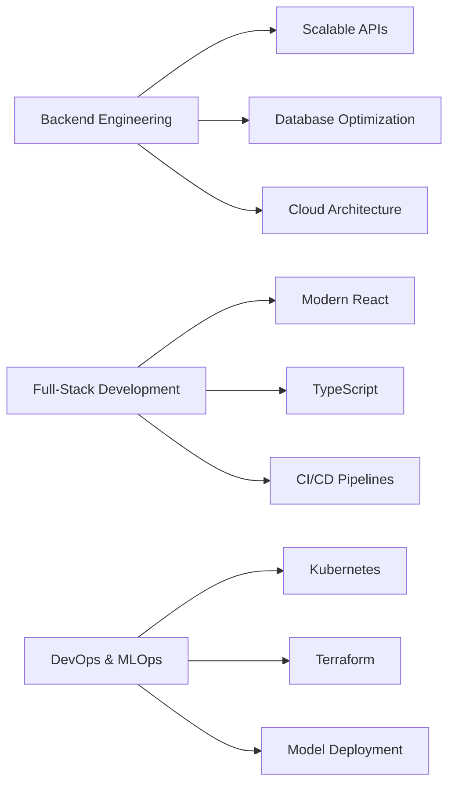

 
  
# 👋 Hi, I'm Satyam
 
 
### 🚀 Code Craftsman | Backend Alchemist | IIT Delhi

---

## 💫 About Me

- 🎓 **B.Tech in Biochemical Engineering** @ **IIT Delhi**
- 📍 Based in **Delhi, India**
- 💼 Specializing in **Backend & Full-Stack Development**
- 🔭 Building **high-performance backend systems** and **scalable applications**
- 🌱 Exploring **Microservices**, **Distributed Systems** & **Cloud Architecture**
- ⚡ **Fun fact:** Reduced data handling latency by **50%** processing **100K+ records/run**
- 💡 Passionate about **DevOps**, **ML Engineering**, and **System Design**
- 🎯 Focused on clean architecture and optimal performance

---

## 🛠️ Tech Stack

### Backend & Databases

### Frontend & UI

### DevOps & Cloud

### Tools & Technologies

---

## 🎯 Featured Projects

<table>
<tr>
<td width="50%">

### 🏢 [API-Driven Classroom Management](https://github.com/soni-satyam/API-Driven-Classroom-Management-System)
**Backend-Centric Platform with Role-Based Access**

🔹 Built with Django, DRF, PostgreSQL, Redis  
🔹 JWT authentication & async task handling  
🔹 **35% improvement** in API response time  
🔹 15+ optimized RESTful endpoints

</td>
<td width="50%">

### 🌐 [Full-Stack Django-React App](https://github.com/soni-satyam/Full-Stack-Web-Application-using-Django-React)
**Secure Web Application with Modern Architecture**

🔹 Django REST + React + MongoDB  
🔹 OAuth-based authentication  
🔹 **30% faster** page load times  
🔹 Dockerized deployment

</td>
</tr>

</td>
</tr>

<tr>
<td width="50%">

### 🧬 [TFADS Bioanalysis Platform](https://github.com/soni-satyam/Biomedical-RAG)
**Cancer Drug Screening System**

🔹 Django + React + ML pipelines  
🔹 100K+ droplet records processing  
🔹 **50% latency reduction**  
🔹 Real-time data streaming

</td>
<td width="50%">

### 🛒 [Microservices E-Commerce](https://github.com/soni-satyam/Microservices-E-Commerce)
**Distributed Spring Boot Architecture**

🔹 Spring Boot microservices  
🔹 Service discovery & API gateway  
🔹 Event-driven architecture  
🔹 Cloud-native deployment

</td>
</tr>
</table>

---

## 📈 Current Focus

🎯 **Currently Working On:**
- Designing distributed systems with microservices architecture
- Implementing advanced caching strategies with Redis
- Building ML inference pipelines with TensorRT
- Exploring Kubernetes orchestration for production deployments

---

## 🤝 Let's Connect!

I'm always interested in collaborating on challenging backend projects, discussing system design, or exploring new technologies!

**💬 Open to:**
- Backend Engineering Opportunities
- Full-Stack Development Roles
- Freelance/Contract Projects
- Open Source Collaborations

---

### 💡 "Building scalable systems, one API at a time"

⭐️ From [satyamsoni](https://github.com/soni-satyam)

